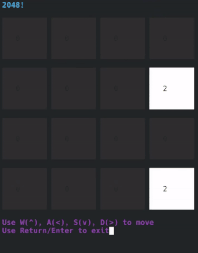
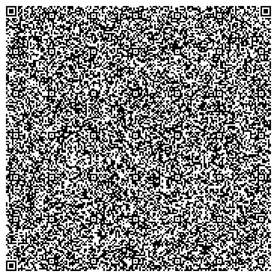

# Say Cheese Assembly Example

The assembly example is a game of 2048 in the terminal!
It runs on x86_64 unix systems, but can also be run in `wsl` on Windows.
It uses WASD to move, and Enter/Return to exit.

The game can be downloaded from [this url](), or from scanning the QR code (of course)!

The program just barely fits inside the QR code,
coming in at at just 2,288 bytes!

The program runs using Linux syscalls to do things such as write to the terminal and read keyboard input.
Once of the most important features is the colors,
which can take up lots of space with how many colors are implemented.
You might notice that I split up the color codes into distinct sections in order to remove as much duplicate data as possible,
ideal for size optimization.

Here are some resources I found useful when developing this:
 - [x86_64 Regsiter Reference](https://www.cs.uaf.edu/2017/fall/cs301/lecture/09_11_registers.html)
 - [Calling Conventions](https://www.agner.org/optimize/calling_conventions.pdf)
 - [x86_64 Arithmetic](https://gpfault.net/posts/asm-tut-3.txt.html)
 - [Linux Syscall Table](https://filippo.io/linux-syscall-table)
 - [ASCII Table](https://www.ascii-code.com)
